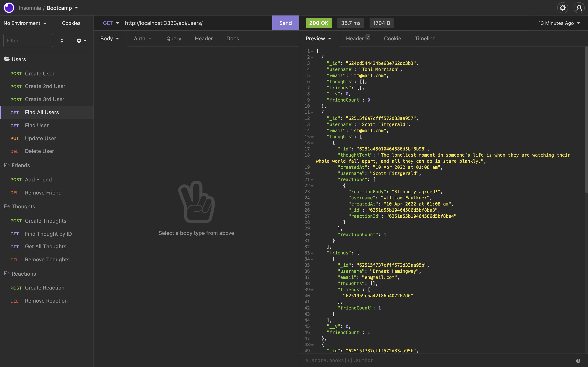
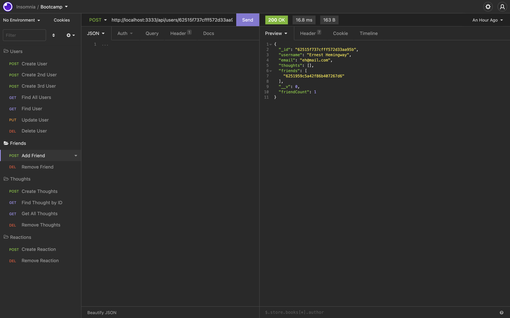
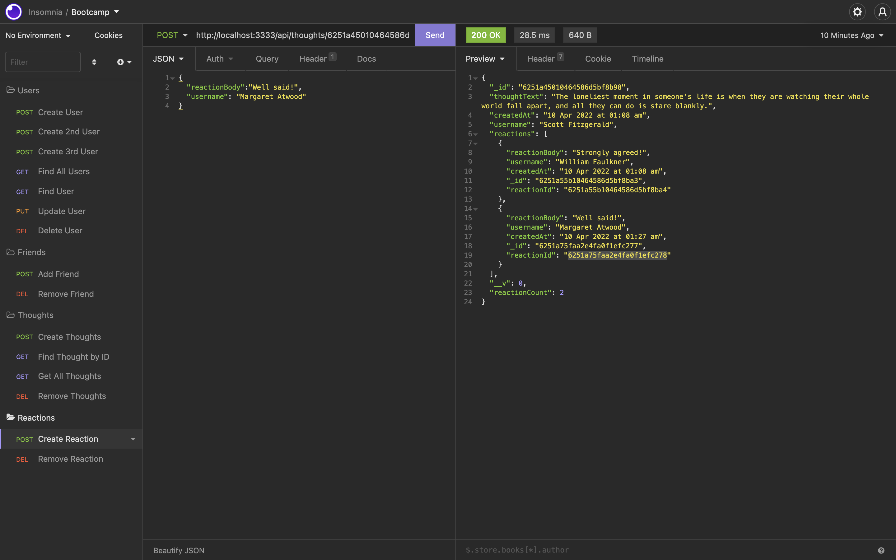

---

# NoSQL Social Network API

  

Table of Contents

<ol>
<li>
<a href="#about-the-project">About The Project</a></li>
<ul>
<li><a href="#built-with">Built With</a></li>
</ul>
</li>
<li>
<a href="#getting-started">Getting Started</a>
<ul>
<li><a href="#installation">Installation</a>
</ul>
</li>
<li><a href="#license">License</a></>
  
<li><a href="#contact">Contact</a></>
  
</ol>
  

## About The Project

This is an API for a social network that uses a NoSQL database so that its website can handle large amounts of unstructured data. This application is built with Express.js for routing, a MongoDB database, and the Mongoose ODM. In addition to using the Express.js and Mongoose packages, I used moment.js to format the date. MongoDB is a popular choice for many social networks due to its speed with large amounts of data and flexibility with unstructured data.

# Users
You can create, update and delete the user data.  
You can find all the data of users as well as find a user by id. 

 

[Click Here to see the Video](https://drive.google.com/file/d/1zWS9q43QPb1OwmxJ1lGYP42LctBEPVs7/view)

# Friends

You can add and remove friends.

 

[Click Here to see the Video](https://drive.google.com/file/d/1snspWvu_8iNIsUMij3SLgFMJPxdkVkh_/view)

# Thoughts

You can create, update and delete the user thoughts.  
You can find all the data of thoughts as well as find a thought by id.  

 

[Click Here to see the Video](https://drive.google.com/file/d/1c35_3Pjy8_hDeRxShff4qG5FlNMlLxzi/view)

# Reactions 

You can add reactions to thoughts and remove the reactions.

 

[Click Here to see the Video](https://drive.google.com/file/d/1snspWvu_8iNIsUMij3SLgFMJPxdkVkh_/view)

(<a href="#top">back to top</a>)</>

 ## Built With
* [Express.js](https://expressjs.com/) 
* [Moment.js](https://momentjs.com/) 
* [Mongoose](https://mongoosejs.com/) 
* [MongoDB](https://www.mongodb.com/)

 (<a href="#top">back to top</a>)</>

## Getting Started

To get a local copy up and running follow these simple example steps.

 ## Installation

The application will be invoked by using the following command:

`git clone git@github.com:ayacomputer/18-Social-Network-API`

How to run the application: 
[Click here to watch video](https://drive.google.com/file/d/17M4K91NyXEuzXUpWaQHI-xUKPFNJ0y9i/view)

(<a href="#top">back to top</a>)</>

## License

Distributed under MIT License.

See LICENSE.txt for more information.

(<a href="#top">back to top</a>)</>

 ## Contact Me

Ayako Woollan - ayako.woollan@gmail.com

Project Link: [https://github.com/ayacomputer/18-Social-Network-API](https://github.com/ayacomputer/18-Social-Network-API)

(<a href="#top">back to top</a>)</>
